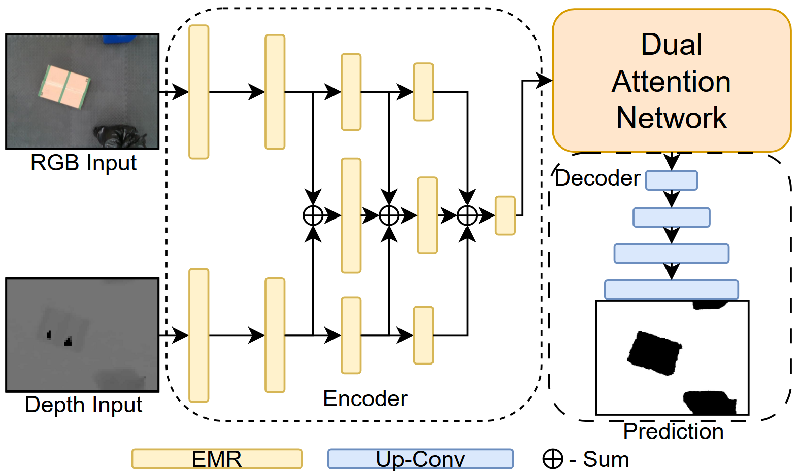

## LandSeg - Landing Surface Segmentor for Unstructured Indoor Environment from our work of UAV Safe Landing Site Detection, Localization, and Navigation in Unstructured Indoor Environments
<div align="center">
    
</div>
Our model LandSeg is made publicly available on this page, along with the data processing script we used to generate the training data. 

Sample training data and the weights of the model used in our work will be available here: https://drive.google.com/drive/folders/1g7ANatOuf2nr9u-yHpZJFwRcO-KzraGS?usp=drive_link

An overview video of this model being applied to our work of UAV Safe Landing Site Detection Localization and Navigation in Unstructured Indoor environments is available here: https://drive.google.com/file/d/1mpL-FK6YKZ28HLuX6XShZL8T2dVJDJLX/view?usp=drive_link

All experimental videos of safe autonomous landing using this model are also made available here: https://drive.google.com/drive/folders/1HGSqoN6_jIMuP54heN2u5vC9tckkGqOs?usp=drive_link


## Requirements for LandSeg
Make sure to install the dependencies:
```bash
pip install -r requirements.txt
```
Install Pytorch using: https://pytorch.org/get-started/locally/

## Training & Testing
To train model: 
```bash
python train.py
```
To test model:
```bash
python test_image.py
```

## Acknowledgment
This work is inspired by the following repositories. We would also like to give a special thanks to the authors of TwinLiteNet for providing open-source packages for developing and training ESPNet-based models.
- [ESPNet](https://github.com/sacmehta/ESPNet)
- [TwinLiteNet](https://github.com/chequanghuy/TwinLiteNet)
- [RESNEXT](https://github.com/facebookresearch/ResNeXt)
- [DAN](https://github.com/junfu1115/DANet)

---
